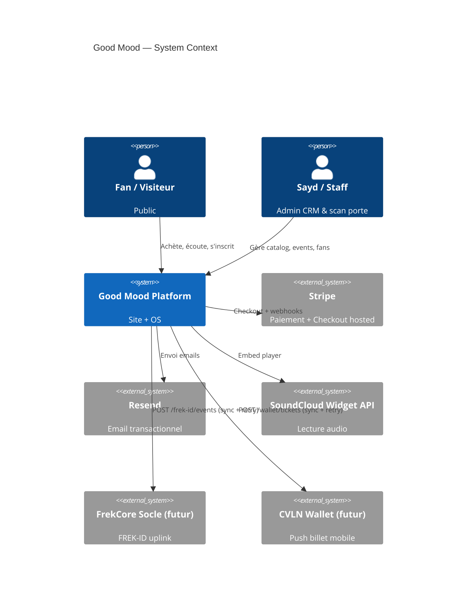
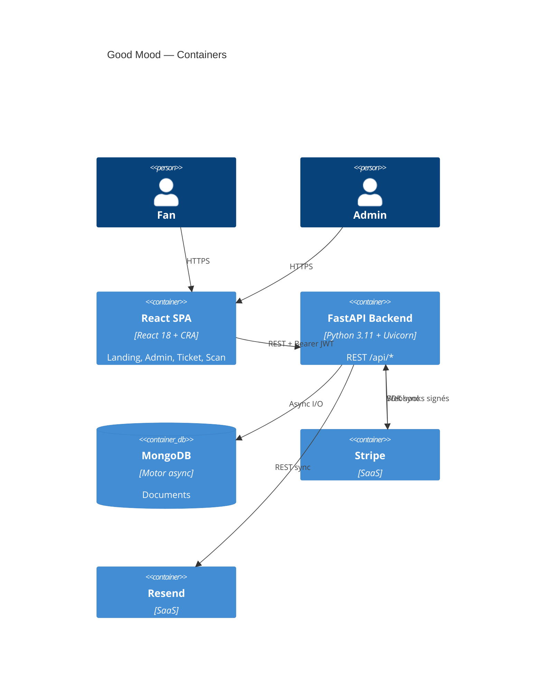
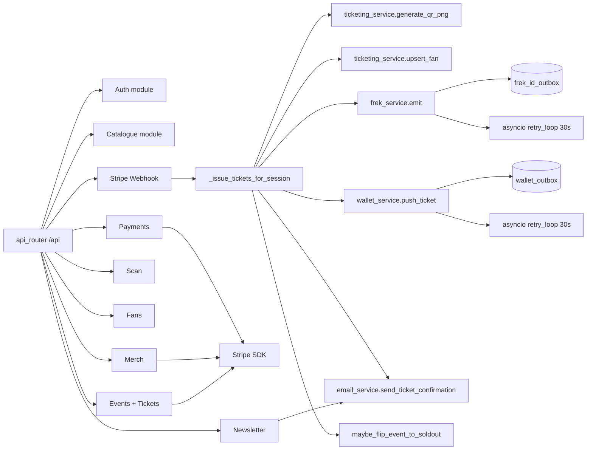
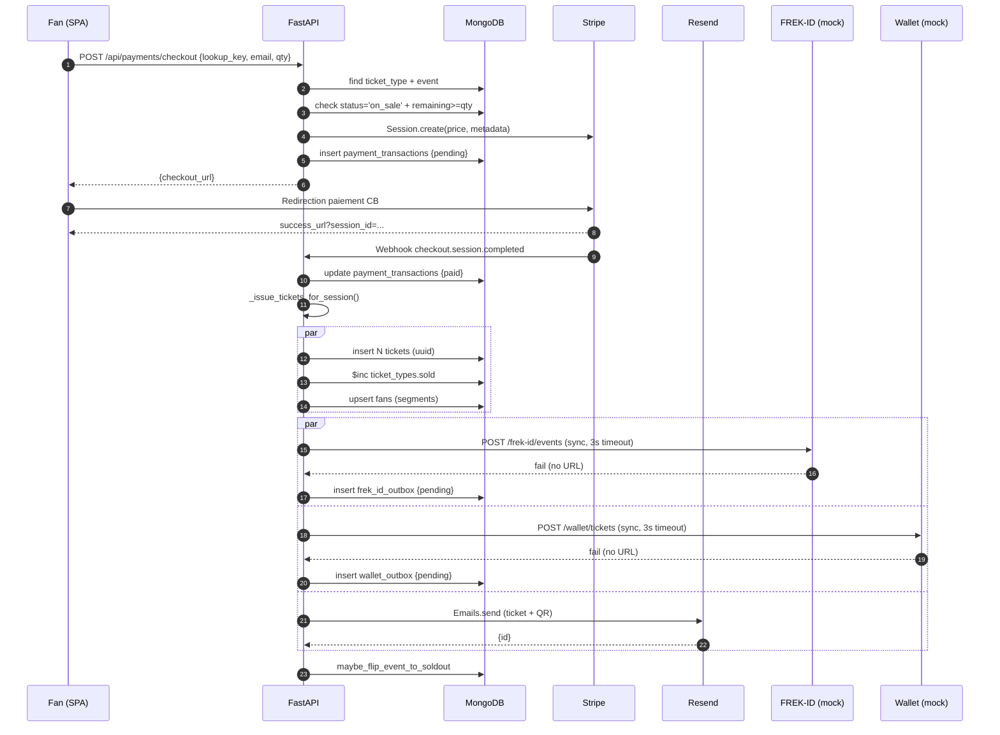
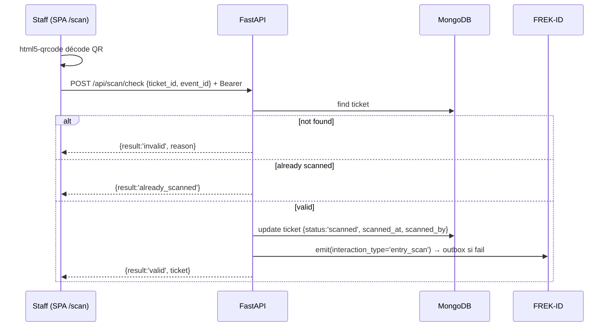
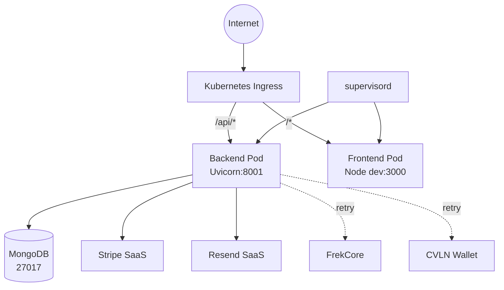

# 02 — ARCHITECTURE (Observé + Inféré)

## 2.1 Architecture globale

Monolithe applicatif 2-tiers avec intégrations tierces synchrones et asynchrones (outbox pattern).

## 2.2 C4 — Level 1 : Context

## 2.3 C4 — Level 2 : Container

## 2.4 C4 — Level 3 : Component (Backend)

## 2.5 Diagramme de séquence — Achat billet (parcours critique)

## 2.6 Diagramme de séquence — Scan porte

## 2.7 Architecture physique / cloud

## 2.8 Architecture sécurité

- **TLS** terminaison ingress (HTTPS obligatoire)
- **JWT HS256** — Bearer token 12h, secret env `JWT_SECRET`
- **bcrypt** password hashing (cost par défaut, ~12)
- **Stripe webhook signature** vérifiée (`STRIPE_WEBHOOK_SECRET`)
- **CORS** whitelist configurable
- **httpOnly cookie** disponible en fallback (route login pose aussi le cookie)

## 2.9 Composants transverses

| Composant | Impl. | Fichier |
|-----------|-------|---------|
| Authentification | JWT + bcrypt | `server.py:hash_password`, `verify_password`, `create_token`, `get_current_admin` |
| Autorisation | Rôle admin gated par dépendance FastAPI | `Depends(get_current_admin)` |
| Journalisation | `logging` stdlib format standard | `server.py` bas de fichier |
| Gestion erreurs | `HTTPException` FastAPI | Partout |
| Monitoring | supervisord logs (`/var/log/supervisor/`) | Inféré |
| Observabilité | **Non disponible dans le projet** (pas de Sentry / OpenTelemetry) | — |
| Sauvegardes | **Non disponible dans le projet** (à externaliser sur MongoDB Atlas ou snapshots K8s) | — |
| Cache | **Non disponible dans le projet** — recommandation Redis pour ticket_types hot path | — |
| Files d'attente | **Outbox pattern maison** (Mongo + retry loop asyncio) | `frek_service.py`, `wallet_service.py` |
