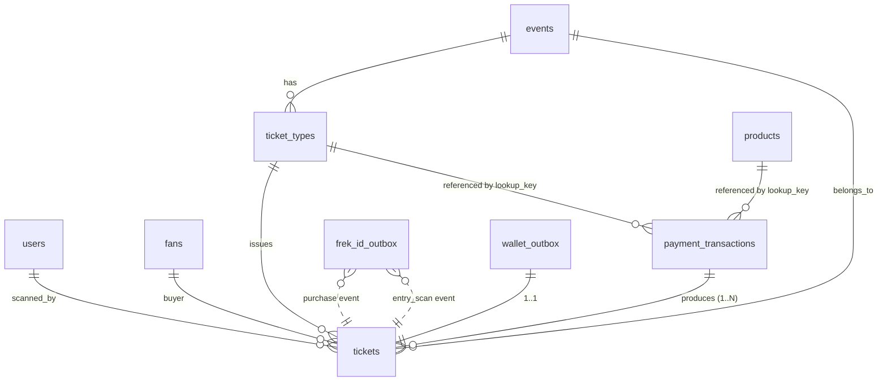

# 06 — BASE DE DONNÉES (Observé)

**Technologie** : MongoDB (Motor async driver). Base = `${DB_NAME}` env-configurable.

## Collections

| Collection | Rôle | Index |
|-----------|------|-------|
| `users` | Comptes admin | unique `email` |
| `catalogue` | 9 volumes SoundCloud | — |
| `events` | Événements Good Mood Live | `date` |
| `ticket_types` | Types de billets par event | `event_id`, unique sparse `lookup_key` |
| `tickets` | Billets nominatifs (1 doc = 1 entrée) | unique `id`, `event_id` |
| `fans` | CRM fan | unique `email` |
| `products` | Merch | — |
| `payment_transactions` | Sessions Stripe (paid/pending/failed) | unique `session_id` |
| `newsletter` | Subscribers | unique `email` |
| `frek_id_outbox` | File FREK-ID | composite `(status, next_attempt_at)` |
| `wallet_outbox` | File Wallet | composite `(status, next_attempt_at)` |
| `tour` | Legacy — migré au startup, conservé pour trace | — |

## ERD (relations logiques)

## Schémas champs (extrait — voir Modèles pour la version complète)

### `users`
- `email` string uniq · `password_hash` bcrypt · `role` `admin` · `name` · `created_at` ISO

### `events`
- `id` uuid · `name` · `city` · `country` · `venue` · `date` ISO · `currency` (eur/usd/gbp)
- `capacity` int · `status` enum · `ticket_url` string · `created_at`

### `ticket_types`
- `id` uuid · `event_id` FK · `name` · `price_cents` int · `quota` int · `sold` int
- `sale_start` `sale_end` ISO · `lookup_key` uniq · `stripe_product_id` · `stripe_price_id`

### `tickets`
- `id` uuid (payload QR) · `event_id` · `ticket_type_id` · `ticket_type_name` · `event_name` · `event_date`
- `city` · `venue` · `buyer_email` · `buyer_name` · `session_id`
- `status` enum {valid, scanned, invalid} · `scanned_at` · `scanned_by`

### `fans`
- `email` uniq · `external_id` `gm-fan-{local}` · `name` · `purchases[]` (event_id, name, date, city, ticket_type, purchased_at)
- `total_events` · `cities[]` · `segments[]`

### `payment_transactions`
- `session_id` uniq · `lookup_key` · `type` {ticket, merch} · `event_id?` `ticket_type_id?` `buyer_email?`
- `quantity` · `amount_cents` · `currency` · `status` · `payment_status` · `variant` · `tickets_issued` · `ticket_ids[]`
- `stripe_payment_intent_id` · `customer_email` · `created_at` · `updated_at`

### `products`
- `id` uuid · `name` · `description` · `image_url` · `price_cents` · `currency`
- `category` · `variant_label` · `variants[]` · `active` · `order`
- `lookup_key` · `stripe_product_id` · `stripe_price_id`

### `catalogue` (Volume)
- `id` · `number` · `title` · `year` · `plays` · `description` · `cover_url` · `listen_url` · `sc_track` · `order`

### `newsletter`
- `id` · `email` uniq · `lang` · `subscribed_at`

### `frek_id_outbox` / `wallet_outbox`
- `payload` dict · `interaction_type` (frek-id) · `target_url` snapshot · `status` {pending, delivered, failed}
- `attempts` int · `last_error` · `next_attempt_at` ISO · `delivered_at` · `created_at`

## Contraintes & validations

- Validation Pydantic à l'entrée (types, ranges, enums)
- Contraintes MongoDB : indexes uniques (email users, email fans, email newsletter, session_id, ticket.id, lookup_key ticket_types)
- Aucun trigger MongoDB (logique métier en couche applicative)

## Migrations (observées, idempotentes)

1. **Admin seed** — insert si absent, sinon rehash mdp si changé
2. **Catalogue seed** — insert 9 volumes si collection vide
3. **Catalogue backfill** — set `cover_url` si vide (indépendant du gate)
4. **Catalogue rewrite** — remplace titres/années/plays/urls si le doc a un titre legacy OU pointe encore vers l'URL playlist (n'écrase jamais une édition admin)
5. **Tour → Events** — migration one-shot si events vide et tour non-vide

## Jeux de données initiaux

- 9 volumes Catalogue (2017-2022, plays réels)
- 18 events migrés depuis l'ancien Tour (statut `announced`)
- Compte admin `admin@goodmood.com`
