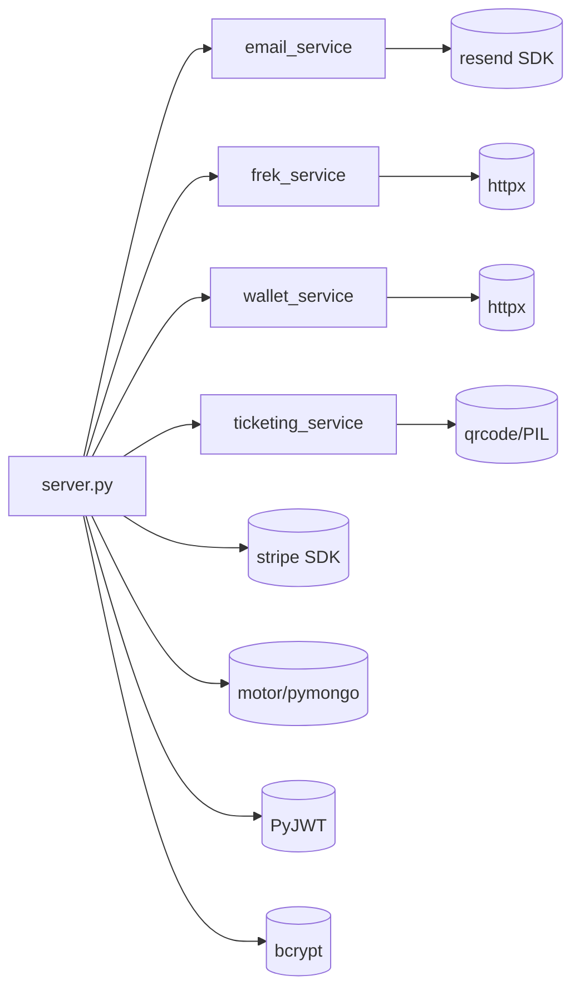

# 08 — DÉPENDANCES ENTRE MODULES

## Graphe backend



## Graphe frontend

```mermaid
graph LR
    App --> Landing
    App --> AdminLogin
    App --> AdminDashboard
    App --> PaymentSuccess
    App --> PaymentCancel
    App --> TicketView
    App --> StaffScan
    Landing --> Hero3DCanvas
    Landing --> TopNav
    Landing --> Catalogue
    Landing --> Tour
    Landing --> Merch
    Landing --> Newsletter
    TopNav --> LanguageSwitcher
    Catalogue --> SoundCloudPlayer
    Tour --> TicketPicker[TicketPicker modal - inside Tour.jsx]
    AdminDashboard --> Modal[Modal + forms - inline]
    StaffScan --> html5qr[(html5-qrcode)]
    Hero3DCanvas --> R3F[(@react-three/fiber + three)]
    All --> api.js
    api.js --> axios[(axios)]
    All --> i18n[(react-i18next)]
```

## Dépendances externes critiques

| Externe | Criticité | Fallback |
|---------|-----------|----------|
| **Stripe** | 🔴 Bloquante pour paiement | Aucun (mode dégradé = pas de vente) |
| **MongoDB** | 🔴 Bloquante | Aucun |
| **Resend** | 🟠 Best-effort | Emails skippés, achat/newsletter réussissent quand même |
| **SoundCloud oEmbed + Widget** | 🟠 Best-effort côté public | Fallback lien externe si widget bloqué |
| **FrekCore (futur)** | 🟠 Best-effort synchrone | Outbox + retry (jamais perdu) |
| **CVLN Wallet (futur)** | 🟠 Idem | Outbox + retry |

## Couplage & cohésion

- **Cohésion** : haute par module (chaque `*_service.py` a une responsabilité unique)
- **Couplage** : `server.py` centralise les routes → couplage entrant élevé (voir Dette technique)
- **Dette technique identifiée** (par testing agent) :
  - `server.py` 874 lignes → recommandation : split en `routes/events.py`, `routes/tickets.py`, etc.
  - `_sync_product_to_stripe` et `_sync_ticket_type_to_stripe` partagent 90% du code → `_sync_stripe_item` extrait (fait), mais les 2 wrappers pourraient disparaître
  - `frek_service` + `wallet_service` = même pattern outbox → recommandation `OutboxWorker` générique
  - `AdminDashboard.jsx` 675 lignes → extraire `EventForm`, `TicketTypeForm`, `EventsTab`, `FansTab`
  - `/api/tour` alias vers `/api/events` → à retirer après migration complète
